<div align="center">

# TaskProvision

[](https://pypi.org/project/taskprovision/)
[](https://pypi.org/project/taskprovision/)
[](https://github.com/taskprovision/python/blob/main/LICENSE)
[](https://github.com/taskprovision/python/actions)
[](https://codecov.io/gh/taskprovision/python)
[](https://taskprovision.readthedocs.io/)
[](https://github.com/psf/black)
[](https://lgtm.com/projects/g/taskprovision/python/context:python)
[](https://lgtm.com/projects/g/taskprovision/python/alerts/)
[](https://pypistats.org/packages/taskprovision)
[](https://github.com/psf/black)
[](https://pycqa.github.io/isort/)
[](https://github.com/astral-sh/ruff)
[](https://github.com/pre-commit/pre-commit)

</div>

TaskProvision is an AI-Powered Development Automation Platform that helps developers automate repetitive tasks, generate high-quality code, and maintain code quality standards.

## 🚀 Features

- AI-powered code generation
- Automated code quality checks
- Task management and automation
- Integration with popular development tools
- Extensible architecture

## 📦 Installation

### Using pip
```bash
pip install taskprovision
```

### From source
```bash
git clone https://github.com/taskprovision/python.git
cd python
pip install -e .[dev]
```

## 🛠️ Development Setup

1. Clone the repository:
   ```bash
   git clone https://github.com/taskprovision/python.git
   cd python
   ```

2. Set up a virtual environment:
   ```bash
   python -m venv venv
   source venv/bin/activate  # On Windows: venv\Scripts\activate
   ```

3. Install development dependencies:
   ```bash
   pip install -e .[dev]
   ```

4. Install pre-commit hooks:
   ```bash
   pre-commit install
   ```

## 🧪 Running Tests

```bash
# Run all tests
pytest

# Run tests with coverage
pytest --cov=taskprovision --cov-report=term-missing
```

## 📚 Documentation

Documentation is available at [taskprovision.readthedocs.io](https://taskprovision.readthedocs.io/).

## 🤝 Contributing

Contributions are welcome! Please see our [Contributing Guide](CONTRIBUTING.md) for details.

## 📄 License

This project is licensed under the Apache 2.0 License - see the [LICENSE](LICENSE) file for details.

## 📞 Support

For support, please open an [issue](https://github.com/taskprovision/python/issues) or email info@softreck.dev.

TaskProvision - AI-Powered Development Automation Platform

# 🚀 WronAI AutoDev - AI-Powered Development Automation Platform

## 📋 Produkt Overview

**WronAI AutoDev** to platforma AI, która automatyzuje proces developmentu dla małych zespołów i freelancerów. Łączy w sobie najlepsze elementy TaskGuard, ELLMa i goLLM w jeden sprzedawalny produkt.

### 🎯 Value Proposition
- **"Od pomysłu do działającego kodu w 15 minut"**
- Automatyczne generowanie kodu z LLM
- Quality guard zapewniający jakość
- Task management z AI insights
- Self-hosted na własnym VPS

### 💰 Pricing Strategy
- **Starter**: $29/msc (do 3 projektów)
- **Professional**: $79/msc (unlimited projekty + team features)
- **Enterprise**: $199/msc (white-label + custom integrations)

## 🎪 Customer Acquisition Strategy

### 1. 🎯 Target Customers Discovery
Zamiast zgadywać kto potrzebuje AI development tools, znajdźmy ich aktywnie:

```bash
# GitHub Lead Mining Script
#!/bin/bash
# search_potential_customers.sh

# Szukamy firm/osób, które:
# 1. Mają problemy z kodem (dużo issues)
# 2. Małe zespoły (2-10 kontrybutorów)  
# 3. Używają Pythona/JavaScript
# 4. Ostatnia aktywność < 30 dni

curl -H "Authorization: token $GITHUB_TOKEN" \
  "https://api.github.com/search/repositories?q=language:python+size:>1000+contributors:2..10+updated:>2024-11-01&sort=updated&per_page=100" \
  | jq '.items[] | {name: .name, owner: .owner.login, issues: .open_issues_count, stars: .stargazers_count, updated: .updated_at, contributors_url: .contributors_url}' \
  > potential_customers.json

# Analiza potencjalnych klientów
python3 analyze_prospects.py potential_customers.json
```

### 2. 📧 Automated Outreach Pipeline

**Clay.io Setup** (Free 14-day trial):
```yaml
# Clay Workflow for Lead Generation
data_sources:
  - github_api: "Repository analysis"
  - company_enrichment: "Find decision makers"
  - email_finder: "Contact information"
  
personalization:
  - "I noticed {{company}} has {{open_issues}} open issues in {{repo_name}}"
  - "Your team could save {{estimated_hours}} hours/week with AI automation"
  - "Free 15-minute demo: Turn your biggest pain point into automated solution"

follow_up_sequence:
  day_0: "Personal GitHub analysis + value prop"
  day_3: "Case study: Similar company, 60% faster development"
  day_7: "Free tool: GitHub repository health checker"
  day_14: "Last chance: 50% discount for early adopters"
```

### 3. 🎪 Demo-First Sales Approach

**Interactive Demo Strategy**:
```bash
# demo_generator.py - Personalizowane demo dla każdego klienta
import requests
import openai

def create_personalized_demo(github_repo):
    # Analizuj repozytorium klienta
    repo_analysis = analyze_repo(github_repo)
    
    # Wygeneruj demo based on ich problemów
    demo_scenario = f"""
    Based on {github_repo}, create a demo showing:
    1. Auto-fixing their top 3 code issues
    2. Generating tests for untested functions
    3. Optimizing their slowest module
    
    Demo URL: https://demo.wronai.com/{client_hash}
    """
    return generate_interactive_demo(demo_scenario)

# Każdy lead dostaje unique demo URL w 5 minut
```

## 🛠️ VPS Setup & Infrastructure

### Application Stack
```python
# main.py - Core WronAI AutoDev Application
from fastapi import FastAPI, BackgroundTasks
from pydantic import BaseModel
import subprocess
import asyncio
import openai

app = FastAPI(title="WronAI AutoDev", version="1.0.0")

class CodeRequest(BaseModel):
    description: str
    github_repo: str = None
    preferred_language: str = "python"

class ProjectAnalysis(BaseModel):
    repo_url: str
    
@app.post("/generate-code")
async def generate_code(request: CodeRequest, background_tasks: BackgroundTasks):
    """Generate high-quality code from description"""
    
    # 1. Use ELLMa for code generation
    code = await ellma_generate(request.description, request.preferred_language)
    
    # 2. Apply TaskGuard quality checks
    quality_report = taskguard_validate(code)
    
    # 3. Use goLLM for optimization
    optimized_code = gollm_optimize(code, quality_report)
    
    # 4. Create deployment files
    deployment_files = create_deployment_package(optimized_code)
    
    return {
        "generated_code": optimized_code,
        "quality_score": quality_report.score,
        "deployment_ready": True,
        "estimated_time_saved": "4-6 hours",
        "files_created": len(deployment_files)
    }

@app.post("/analyze-project")
async def analyze_project(analysis: ProjectAnalysis):
    """Analyze existing project and suggest improvements"""
    
    # Clone and analyze repo
    repo_analysis = await analyze_github_repo(analysis.repo_url)
    
    # Generate improvement suggestions
    suggestions = await generate_ai_suggestions(repo_analysis)
    
    return {
        "health_score": repo_analysis.health_score,
        "issues_found": repo_analysis.issues,
        "suggestions": suggestions,
        "potential_time_savings": f"{suggestions.estimated_hours} hours/week"
    }

@app.get("/demo/{client_hash}")
async def personalized_demo(client_hash: str):
    """Serve personalized demo for specific client"""
    client_data = get_client_data(client_hash)
    demo_content = generate_demo_for_client(client_data)
    
    return {"demo_url": f"/interactive-demo/{client_hash}", 
            "personalized_scenarios": demo_content}

# Background task: Customer success tracking
@app.post("/track-usage")
async def track_customer_usage(user_id: str, action: str):
    """Track user actions for customer success"""
    # Automatyczne śledzenie sukcesu klienta
    # Trigger retention campaigns if needed
    pass
```

## 💰 Revenue Automation Stack

### 1. 🎯 Free Tools for Lead Generation

**GitHub Repository Health Checker** (Darmowy lead magnet):
```python
# free_tools/repo_health_checker.py
def create_free_health_checker():
    """
    Darmowy tool który:
    1. Analizuje repo GitHub
    2. Daje health score
    3. Pokazuje top 5 problemów
    4. Sugeruje rozwiązania
    5. Oferuje "Get full analysis with WronAI AutoDev"
    """
    return """
    🔍 Repository Health Score: 67/100
    
    ❌ Top Issues Found:
    1. 23% functions lack docstrings
    2. 156 lines of duplicate code detected  
    3. 5 security vulnerabilities
    4. Missing unit tests (43% coverage)
    5. 12 outdated dependencies
    
    💡 Estimated fix time: 14 hours manually
    ⚡ WronAI AutoDev: 2 hours automated
    
    🚀 Get Full Analysis + Auto-Fix: [Start Free Trial]
    """

# Embed na stronie jako widget
<script src="https://tools.wronai.com/health-checker.js"></script>
```

### 2. 💳 Billing Setup (Stripe + Self-hosted)

```python
# billing/stripe_integration.py
import stripe
from datetime import datetime, timedelta

stripe.api_key = "sk_test_..."  # Free account

class AutoDevBilling:
    def __init__(self):
        self.plans = {
            "starter": {"price": 29, "projects": 3},
            "professional": {"price": 79, "projects": -1},  # unlimited
            "enterprise": {"price": 199, "custom": True}
        }
    
    def create_customer_subscription(self, email, plan_type, github_username):
        """Create subscription with 14-day free trial"""
        
        customer = stripe.Customer.create(
            email=email,
            metadata={"github": github_username, "source": "autodev"}
        )
        
        subscription = stripe.Subscription.create(
            customer=customer.id,
            items=[{"price": f"price_{plan_type}"}],
            trial_period_days=14,  # Free trial
            metadata={"plan": plan_type}
        )
        
        # Trigger welcome sequence
        self.send_onboarding_email(email, github_username)
        
        return subscription
    
    def usage_based_billing(self, customer_id, api_calls, generation_time):
        """Track usage for potential upselling"""
        
        # Log usage patterns
        usage_data = {
            "customer": customer_id,
            "api_calls": api_calls,
            "generation_time": generation_time,
            "timestamp": datetime.now()
        }
        
        # Auto-suggest plan upgrade if needed
        if api_calls > 1000:  # Starter limit
            self.suggest_upgrade(customer_id, "professional")
```

### 3. 📊 Customer Success Automation

```python
# customer_success/automation.py
class CustomerSuccessBot:
    def __init__(self):
        self.health_thresholds = {
            "login_frequency": 7,  # days
            "api_usage": 10,       # calls/week
            "trial_engagement": 3   # features used
        }
    
    async def monitor_customer_health(self, customer_id):
        """Monitor customer engagement and trigger interventions"""
        
        metrics = await self.get_customer_metrics(customer_id)
        
        # Low engagement detection
        if metrics.days_since_login > 7:
            await self.send_reengagement_email(customer_id)
            
        # Feature adoption tracking
        if metrics.trial_day == 7 and metrics.features_used < 2:
            await self.schedule_personal_demo(customer_id)
            
        # Upgrade opportunity detection
        if metrics.api_calls > metrics.plan_limit * 0.8:
            await self.suggest_upgrade(customer_id)
    
    async def automated_customer_interviews(self, customer_id):
        """AI-powered customer feedback collection"""
        
        interview_questions = [
            "What's your biggest development bottleneck?",
            "How much time does WronAI save you weekly?", 
            "What feature would make this a must-have tool?"
        ]
        
        # Send via email with tracking
        response_data = await self.send_feedback_survey(customer_id, interview_questions)
        return self.analyze_feedback_with_ai(response_data)
```

## 🎪 Campaign Implementation Plan

### Week 1-2: Infrastructure & Lead Generation
```bash
# Day 1: Setup infrastructure
./setup_wronai_infrastructure.sh

# Day 2-3: Deploy application stack  
kubectl apply -f wronai-autodev-deployment.yaml

# Day 4-7: Build free tools
python3 create_free_health_checker.py
python3 create_github_analyzer.py

# Day 8-14: Setup lead generation
# - Clay.io trial setup
# - GitHub lead mining scripts
# - Landing page creation
```

### Week 3-4: Sales Automation
```bash
# Setup email sequences (ConvertKit free trial)
# Create personalized demo system
# Implement Stripe billing
# Launch first outreach campaign (100 prospects)
```

### Week 5-8: Optimization & Scaling
```bash
# A/B test email templates
# Optimize demo conversion
# Implement customer success automation
# Scale to 500+ prospects/week
```

## 📊 Expected Results & ROI

### Month 1 Targets:
- **Leads Generated**: 200+
- **Demo Requests**: 20+
- **Trial Signups**: 10+  
- **Paying Customers**: 3-5
- **MRR**: $150-400

### Month 3 Targets:
- **Leads Generated**: 1,000+
- **Demo Requests**: 100+
- **Trial Signups**: 50+
- **Paying Customers**: 15-25
- **MRR**: $1,200-2,000

### Break-even Analysis:
- **Platform Costs**: $50/month (VPS + domains)
- **Tool Costs**: $0-100/month (free trials initially)
- **Break-even**: 2-3 customers
- **Target**: 10-15 customers by month 3

## 🚀 Implementation Commands

```bash
# 1. Start the complete setup
git clone https://github.com/wronai/autodev-sales-machine.git
cd autodev-sales-machine
chmod +x setup_everything.sh
./setup_everything.sh

# 2. Launch first campaign
python3 campaigns/github_lead_mining.py
python3 campaigns/email_sequence_launch.py

# 3. Monitor results
python3 analytics/campaign_dashboard.py

# Start selling TODAY! 🎯
```

# Strategia Pozyskiwania Klientów dla Rozwiązań Głosowych i Agentów Autonomicznych w Ekosystemie WronAI  

Poniższy plan integruje innowacyjne podejścia z niskobudżetowymi technikami pozyskiwania klientów, skupiając się na unikalnych funkcjonalnościach projektów WronAI: interfejsów głosowych i systemów agentowych uczących się zachowań użytkowników.  

---

## Architektura Rozwiązania: Połączenie Technologii i Marketingu  

### 1. **Voice-First Demo Engine**  
Wykorzystaj **WronAI Assistant** do stworzenia interaktywnego demo głosowego działającego w 3 trybach:  
1. **Diagnostyczny**: Analiza problemów biznesowych poprzez konwersację głosową  
2. **Prognostyczny**: Generacja rozwiązań z wykorzystaniem Allama Benchmark  
3. **Automatyzacyjny**: Integracja z systemem klienta przez API  

```python
from wronai.assistant import VoiceEngine
from allama.benchmark import SolutionGenerator

class VoiceDemo:
    def __init__(self):
        self.engine = VoiceEngine(lang='pl')
        self.solver = SolutionGenerator()
    
    def start_session(self):
        problem = self.engine.record_query()
        analysis = self.solver.analyze(problem)
        solution = self.solver.generate(analysis)
        self.engine.speak_solution(solution)
        return solution
```

---

## Konkretne Techniki Pozyskania z Niskim Budżetem  

### 2.1 **Hyper-Localized Voice SEO**  
- Wdrożenie strategii optymalizacji pod wyszukiwania głosowe:  
  - Tworzenie 30-sekundowych odpowiedzi audio na pytania typu "Jak zautomatyzować [problem branżowy]?"  
  - Hostowanie na własnym serwerze z wykorzystaniem **WronAI docker-platform**  
  - Dystrybucja przez:  
    - Google Business Profile (odpowiedzi na pytania)  
    - Apple Business Connect  
    - Lokalne katalogi usługowe  

**Koszt**: $0 (wykorzystanie istniejących narzędzi WronAI)  
**Efektywność**: 23% wzrost konwersji wg badań First Page Sage [2]  

---

### 2.2 **Autonomiczny Cold Outreach**  
- Automatyzacja procesu pozyskania poprzez:  
  - **Worker Agent** analizujący publicznie dostępne dane:  
    - GitHub activity (nowe projekty w Pythonie)  
    - Stack Overflow threads z błędami kompatybilnymi z AIRun  
    - LinkedIn posts o problemach DevOps  

```javascript
// Worker Agent Configuration
{
  "data_sources": ["github", "stackoverflow", "linkedin"],
  "trigger_keywords": ["edge computing error", "llm optimization", "automated testing"],
  "response_template": "Wykryliśmy {problem} w Twojej działalności. Nasze rozwiązanie {solution} może zautomatyzować ten proces. Demo dostępne pod {link}",
  "comms_channel": "email"
}
```

**Mechanizm działania**:  
1. Worker monitoruje źródła w czasie rzeczywistym  
2. Przy wykryciu problemu generuje spersonalizowaną ofertę  
3. Wysyła poprzez zintegrowany **git2wp** jako landing page  

---

### 2.3 **Gamifikacja Onboardingowa**  
- Wdrożenie systemu nagród dla pierwszych użytkowników:  
  - **TaskGuard** śledzi postępy w integracji  
  - Nagrody w formie:  
    - Darmowych mocy obliczeniowych na WronAI docker-platform  
    - Dostęp do beta wersji **Allama 2.0**  
  - Mechanizm poleceń:  
    - 10% zysk z konwersji poleconych klientów  

**Przykład implementacji**:  
```python
from taskguard.rewards import GamificationEngine

class OnboardingSystem:
    def __init__(self):
        self.gamification = GamificationEngine()
    
    def track_progress(self, user_id):
        tasks_completed = self.gamification.get_tasks(user_id)
        if tasks_completed >= 5:
            self.gamification.grant_reward(user_id, 'free_credits', 100)
            self.gamification.unlock_feature(user_id, 'allama_beta')
```

---

## Kanały Dystrybucji z ROI >300%  

### 3.1 **Voice Ad Network**  
- Tworzenie mikro-kampanii głosowych:  
  - 15-sekundowe spoty generowane przez **WronAI Assistant**  
  - Dystrybucja przez:  
    - Alexa Skill Store (wymiana za recenzje)  
    - Google Assistant Actions  
    - Automotive IVR systems  

**Koszt**: $0.02 za wywołanie  
**Konwersja**: 7.3% wg testów First Page Sage [2]  

---

### 3.2 **Embedded Code Marketing**  
- Publikacja gotowych snippetów kodu z funkcją auto-promocyjną:  
  - Fragmenty integrujące AIRun z popularnymi frameworkami  
  - Ukryty mechanizm: po 100 wykonaniach wyświetla się oferta  

```python
# Przykładowy snippet promocyjny
import airun

def main():
    try:
        # ...kod użytkownika...
    except Exception as e:
        fix = airun.auto_fix(e, premium=True)  # Po 100 wywołaniach sugeruje subskrypcję
        apply_fix(fix)
```

**Dystrybucja**:  
- GitHub Gist  
- Stack Overflow odpowiedzi  
- PyPI pakietów  

---

### 3.3 **AI-Powered Retargeting**  
- Implementacja systemu ponownego zaangażowania:  
  - **Worker Agent** analizuje zachowanie odrzuconych leadów  
  - Generuje spersonalizowane case studies w formie:  
    - Interaktywnych notebooków Jupyter  
    - Symulacji kosztów w Excelu  
    - Wizualizacji ROI w Power BI  

**Mechanizm**:  

```mermaid
graph TD
    A[Lead Odrzucony] --> B{Analiza Przyczyn}
    B --> C[Budget] --> D[Generuj Symulację Kosztów]
    B --> E[Features] --> F[Twórz Demo Specyficzne]
    B --> G[Timing] --> H[Ustaw Reminder Calendar]
```


---

## Metryki Sukcesu i Optymalizacja  

### 4.1 **Autonomiczny System A/B Testujący**  
- Wdrożenie ciągłej optymalizacji poprzez:  
  - **TaskGuard** zarządzający wariantami ofert  
  - **Allama** analizująca wyniki w czasie rzeczywistym  

```python
from allama.ab_testing import AutonomousOptimizer

class CampaignManager:
    def __init__(self):
        self.optimizer = AutonomousOptimizer()
    
    def run_test(self, variants):
        winner = self.optimizer.continuous_test(variants)
        self.optimizer.apply_winner(winner)
```

**Kluczowe wskaźniki**:  
- CAC (Customer Acquisition Cost):  $450  
- Time-to-Conversion:  0.7:
            self.trigger_offer()

## Podsumowanie Implementacyjne  

**Kroki Startowe (Tygodnie 1-4):**  
1. Wdrożenie Voice-First Demo na istniejącej infrastrukturze WronAI  
2. Automatyzacja pozyskania leadów przez Worker Agent (koszt: $0)  
3. Publikacja 50 snippetów kodu z mechanizmem auto-promocji  

**Koszty Inicjalne:**  
- $200/miesiąc na hostowanie demo  
- 8h/miesiąc konserwacji systemu  

**Przewidywane Przychody (Miesiąc 6):**  
- $4,500 z konwersji bezpośrednich  
- $1,200 z programów partnerskich  
- $800 z upsellów  